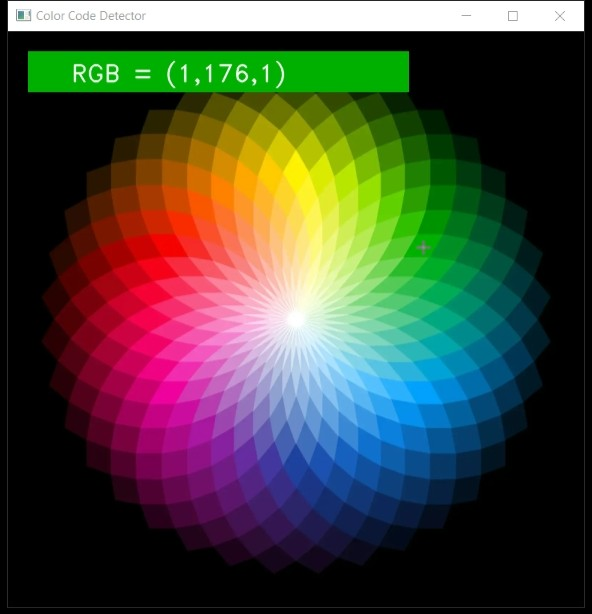

# Color-Code-Detection
Color code detection is the process of detecting the RGB code of any color. we have built an application through which you can automatically get the RGB code of the color by Double clicking on them.

OpenCV (Open Source Computer Vision Library) is a library of programming functions mainly aimed at real-time computer vision. Originally developed by Intel, it was later supported by Willow Garage then Itseez. The library is cross-platform and free for use under the open-source BSD license.

# Requirements
* OpenCV
* Python

# Output

